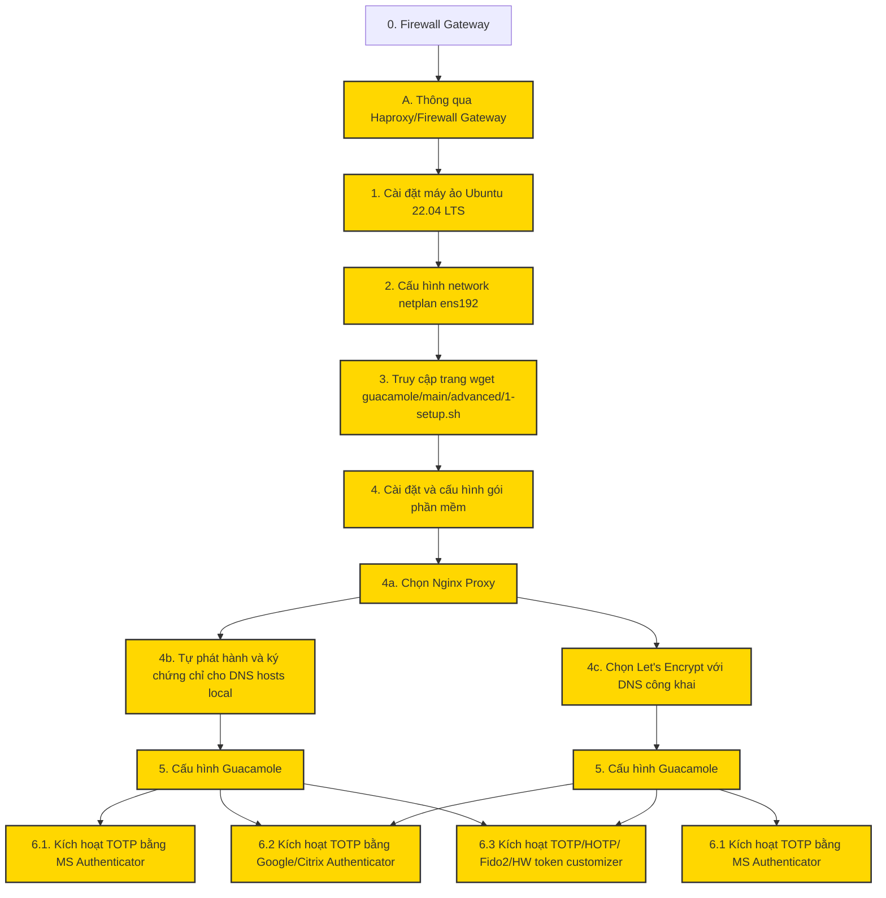

# Triển khai điện toán đám mây và quản lý Ứng dụng tích hợp AI/ML phiên bản 1.6.0:

>>>Hãy so sánh các thay đổi mới tính năng, chức năng, công nghệ thay đổi mới của Guacamole 1.6.0 vs 1.5.5.
Phiên bản Apache Guacamole 1.6.0 là một bản cập nhật lớn (feature release) mang lại nhiều cải tiến công nghệ vượt trội, trong khi phiên bản Guacamole 1.5.5 thuần túy chỉ là một bản vá lỗi nhỏ (bugfix release) để xử lý rò rỉ tài nguyên và cập nhật các thư viện phụ thuộc cũ. [1, 2, 3, 4] 
Dưới đây là bảng so sánh chi tiết giữa hai phiên bản về tính năng, chức năng và công nghệ:
## Bảng so sánh tổng quan

| Đặc tính / Tính năng [1, 2, 3, 4] | Phiên bản cũ 1.5.5 | Phiên bản mới 1.6.0 |
|---|---|---|
| Bản chất phát hành | Bản vá lỗi bảo mật và hiệu năng | Bản cập nhật tính năng và công nghệ lớn |
| Hiệu suất Render | Tiêu chuẩn cũ từ bản 1.5.0 | Tối ưu hóa xử lý phía máy chủ (Server-side) |
| Hỗ trợ FreeRDP | Hỗ trợ FreeRDP phiên bản 2.x | Hỗ trợ chính thức FreeRDP 3.x |
| Phân biệt chữ hoa/thường | Bắt buộc trùng khớp (mặc định cũ) | Cho phép cấu hình phân biệt (Case Sensitivity) |
| Nhập liệu kết nối | Nhập thủ công hoặc cấu hình file lẻ | Hỗ trợ nhập hàng loạt qua CSV, JSON, YAML |
| Xử lý bản ghi video | Chỉ xem lại video thuần túy | Đi kèm các điểm mốc (Keystrokes, Events) |
| Bảo mật Multi-Factor | Duo Web SDK phiên bản cũ | Cập nhật tích hợp lên Duo v4 SDK |

------------------------------
## Các thay đổi mới chi tiết trên Guacamole 1.6.0

## 1. Cải tiến hiệu năng và công nghệ cốt lõi

* Tối ưu hóa đồ họa: Tốc độ phản hồi giao diện màn hình được nâng cao nhờ cơ chế xử lý render mới trên guacd, giảm tải băng thông và độ trễ đồ họa đáng kể. [2, 3] 
* Hỗ trợ FreeRDP 3: Cho phép tương thích tốt hơn với các hệ điều hành Windows đời mới và sửa đổi kiến trúc kênh truyền tải dữ liệu (Virtual Channel). [3] 
* Nâng cấp Docker: Các hình ảnh container (Docker images) được tinh chỉnh lại giúp triển khai nhanh, cấu hình biến môi trường linh hoạt và bảo mật tốt hơn so với bản 1.5.5. [2, 4] 

## 2. Tính năng quản trị và chức năng hệ thống

* Nhập dữ liệu hàng loạt (Batch Import): Người quản trị có thể nạp hàng loạt tài khoản và danh sách kết nối thông qua các tệp định dạng mã nguồn phổ biến (CSV, JSON, hoặc YAML) giúp tiết kiệm thời gian triển khai hệ thống lớn. [3] 
* Cấu hình Case Sensitivity: Hệ thống cho phép tùy biến phân biệt chữ hoa và chữ thường khi đăng nhập. Tính năng này giúp giải quyết triệt để xung đột khi đồng bộ tài khoản từ các nguồn LDAP/Active Directory khác nhau. [2, 3, 4] 
* Phân quyền giám sát (Audit Permission): Thêm một cấp quyền chuyên biệt dành cho điều tra viên. Người dùng có quyền này có thể xem toàn bộ lịch sử kết nối của hệ thống nhưng không được phép xem các video ghi lại màn hình nhạy cảm. [3] 

## 3. Trải nghiệm người dùng kết nối (UX)

* Điểm mốc trên bản ghi (Points of Interest): Khi xem lại các bản ghi phiên làm việc (Session recordings), trình phát video tích hợp giờ đây hiển thị các mốc sự kiện quan trọng (như thao tác gõ phím), giúp người quản trị tua nhanh đến phân đoạn cần kiểm tra thay vì xem toàn bộ video. [3] 
* Ẩn nội dung Clipboard: Clipboard trao đổi giữa máy tính cá nhân và máy từ xa mặc định sẽ được ẩn đi. Người dùng cần nhấn chuột để hiển thị nội dung, tăng cường bảo mật dữ liệu nhạy cảm. [3] 

## 4. Nâng cấp bảo mật và tích hợp bên thứ ba

* Cập nhật Duo v4: Thay thế thư viện Duo Web v3 cũ đã lỗi thời bằng Duo v4 SDK, cải tiến quy trình xác thực hai yếu tố (2FA).
* Vá lỗi bảo mật nghiêm trọng: Khắc phục lỗ hổng xử lý mã console trên các giao thức dạng văn bản (như SSH) của bản 1.5.5, ngăn chặn nguy cơ thực thi mã độc từ xa gây chiếm quyền tiến trình guacd. [2, 4, 5] 

## Bạn muốn tìm hiểu sâu hơn về khía cạnh nào?

* Bạn có cần hướng dẫn nâng cấp an toàn từ bản 1.5.5 lên 1.6.0 để tránh lỗi treo dịch vụ guacd không?
* Bạn muốn tìm hiểu kỹ hơn về cấu hình nhập hàng loạt bằng file CSV/JSON trong bản 1.6.0?
* Bạn có cần cấu hình lại hệ thống xác thực Duo v4 sau khi nâng cấp lên bản mới không? [2, 3, 4, 6, 7] 

[1] [https://guacamole.apache.org](https://guacamole.apache.org/releases/1.5.5/)
[2] [https://guacamole.apache.org](https://guacamole.apache.org/releases/1.6.0/)
[3] [https://www.youtube.com](https://www.youtube.com/watch?v=iQ_DKoZDPNs)
[4] [https://guacamole.apache.org](https://guacamole.apache.org/releases/)
[5] [https://guacamole.apache.org](https://guacamole.apache.org/security/)
[6] [https://lists.apache.org](https://lists.apache.org/thread/1qkgzvjzcwws0kr568ttprmm34rwkmsj)
[7] [https://issues.apache.org](https://issues.apache.org/jira/browse/GUACAMOLE/)

---

# Cài mới Guacamole version 1.5.5: Updated 4.2024
Script guacamole 1.5.5 for Linux e.g: ubuntu 22.04 LTS OpenvSwitch 25Gbps, Tomcat 9.x PHP 8.x MySQL 5.x NGINX 1.8.x Certbot Let's Encrypt 2.x TLS 1.2/1.3

1. Bước 1. Run: Download và chạy code cài guac Gõ lệnh trên thông qua màn PuTTy đã kết nối thành công tới ipv4 của Ubuntu 22.04/20.04:
   
wget https://raw.githubusercontent.com/PhDLeToanThang/guacamole/main/1.5.5/1-setup.sh

- LƯU Ý: SSHD cần cài và cấu hình PPK và chặn dải ip4 trong local MNGT để không cho internet truy cập.
- Tham khảo: https://thangletoan.wordpress.com/2023/09/29/cach-2-dung-puttygen-co-the-sinh-key-ppk-va-cau-hinh-public-key-bao-ve-ssh-cua-ubuntu-20-04/ 

2. Bước 2. Cấp quyền chạy và dùng lệnh chạy: 
bash 1-setup.sh

# Cài mới Guacamole version 1.5.4: Updated 2.2024
Script guacamole 1.5.4 for Linux e.g: ubuntu 22.04 LTS OpenvSwitch 25Gbps, Tomcat 9.x PHP 8.x MySQL 5.x NGINX 1.8.x Certbot Let's Encrypt 2.x TLS 1.2/1.3

1. Bước 1. Run: Download và chạy code cài guac Gõ lệnh trên thông qua màn PuTTy đã kết nối thành công tới ipv4 của Ubuntu 20.04:
   
wget https://raw.githubusercontent.com/PhDLeToanThang/guacamole/main/advanced/1-setup.sh

- LƯU Ý: SSHD cần cài và cấu hình PPK và chặn dải ip4 trong local MNGT để không cho internet truy cập.
- Tham khảo: https://thangletoan.wordpress.com/2023/09/29/cach-2-dung-puttygen-co-the-sinh-key-ppk-va-cau-hinh-public-key-bao-ve-ssh-cua-ubuntu-20-04/ 

2. Bước 2. Cấp quyền chạy và dùng lệnh chạy: 
bash 1-setup.sh

Hoặc sẽ có bản thiết kế chuyên sâu hơn:

# Muốn nâng cấp lên Guacamole version 1.5.4: Updated 7.12.2023
Script guacamole 1.5.4 for Linux e.g: ubuntu 22.04 LTS OpenvSwitch 25Gbps, Tomcat 9.x PHP 8.x MySQL 5.x NGINX 1.8.x Certbot Let's Encrypt 2.x TLS 1.2/1.3

1. Bước 1. Run: Download và chạy code cài guac Gõ lệnh trên thông qua màn PuTTy đã kết nối thành công tới ipv4 của Ubuntu 20.04:
   
wget https://raw.githubusercontent.com/PhDLeToanThang/guacamole/main/advanced/s1-setup.s

- LƯU Ý: SSH không hoạt động với Ubuntu 22.04:
Guacamole chỉ hỗ trợ ssh-dss và ssh-rsa và cả hai đều đã bị tắt trong Ubuntu 22.04.
Trong thời gian chờ đợi, giải pháp thay thế là thêm HostKeyAlgorithms +ssh-rsa vào cuối /etc/ssh/sshd_config trên máy Ubuntu và khởi động lại sshd.

2. Bước 2. Cấp quyền chạy và dùng lệnh chạy: 
bash s1-setup.sh
